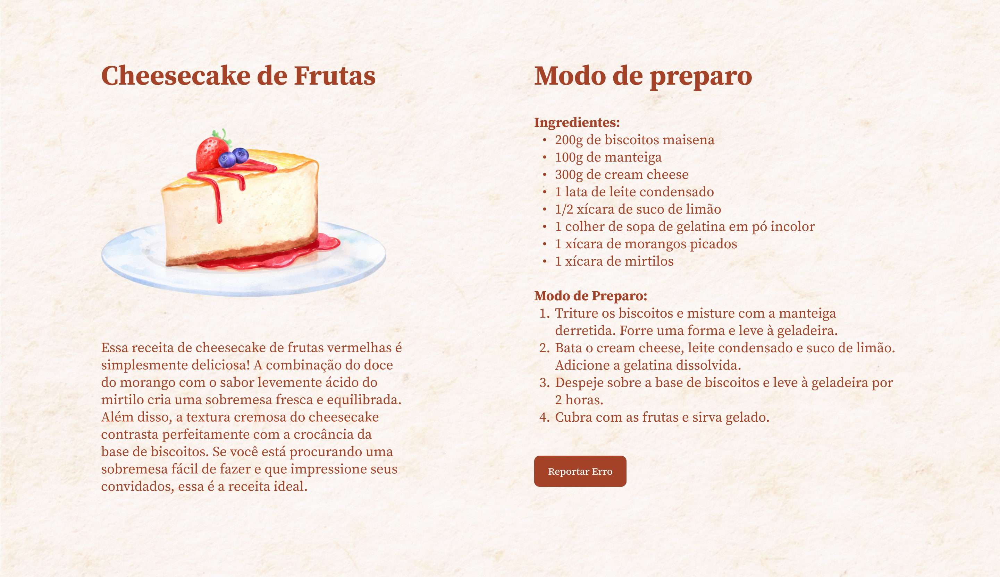
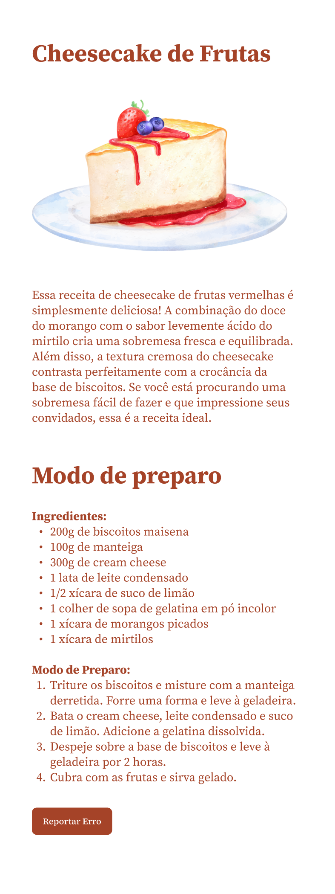

# Explorer Project 5

## Overview

**Explorer Project 5** is an educational project focused on learning more about web design responsiveness. It's based on a Figma design, allowing for practical experience in converting a Figma layout into a responsive website. This project serves as a great resource for those looking to enhance their skills in creating web designs that adapt seamlessly across different devices.

The Figma design can be viewed here: [Cheesecake - Projeto Explorer Community](https://www.figma.com/file/Oy0t9DhhbS8vsRmnqRzURx/Cheesecake-%E2%80%A2-Projeto-Explorer-Community?type=design&is-community-duplicate=1&fuid=)

### Project Preview

Below are the previews of the website as developed from the Figma design:

1. **Desktop Version Preview:**

   

2. **Mobile Version Preview:**

   

These previews showcase the adaptability and responsiveness of the website's design, demonstrating its effectiveness across different screen sizes.

### Project Structure

The project comprises the following main components:

- **index.html**: This is the main HTML document that structures the web page.
- **style.css**: The CSS file that contains all the styling rules for the project.
- **assets/**: This directory holds all the images and other resources used in the project.

### Cloning the Repository

To clone the repository and explore the project on your own, use the following command:

```bash
git clone https://github.com/giovannivicentin/explorer-project-5
```

This will copy the entire project to your local machine, allowing you to view, modify, and test the project locally.

---
